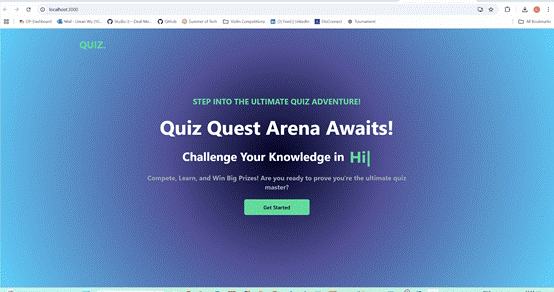
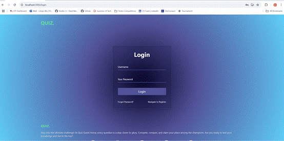
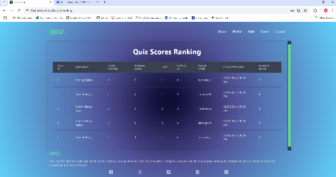
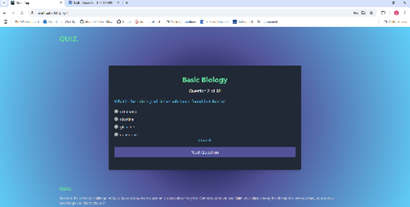
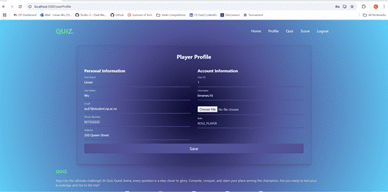

# QuizQuestArena - Frontend (React.js)

Frontend React.js application for QuizQuestArena platform.  
This app connects with the backend Spring Boot API to allow users to participate in live quiz tournaments, view results, and manage their profiles.

## 🚀 Overview

- User-friendly interface for Players and Admins
- User registration, login and logout
- Participate in ongoing quiz tournaments
- View scores and leaderboard
- Like/unlike tournaments
- Admin panel for quiz management
- Password reset and profile management

## 🛠 Technologies

- React.js (ES6+)
- Axios (API communication)
- Tailwind CSS
- npm
- GitHub version control

## 📌 Features

### User Features
- Register, login and logout
- Forgot password flow
- View and edit user profile
- Browse quizzes: ongoing, upcoming, past, participated
- Participate in ongoing tournaments (single-question-per-page)
- View final score and feedback after quiz
- Like/unlike quizzes

### Admin Features
- Create, update and delete quizzes
- View list of tournaments
- Control quiz access (ongoing, upcoming)

### Gameplay Flow
- Player logs in and joins ongoing tournament
- Each question shown on separate page
- Correct/incorrect feedback after each question
- Final score shown at the end
- View and like tournaments

## 📷 Screenshots







## 📝 How to Run

1. Clone this repository
2. Open terminal and run:

```bash
npm install
npm start
```
3. Application will run on http://localhost:3000
4. Make sure backend API is running on http://localhost:8080 for full functionality

## 📝 Future Improvements

-- Improve responsive design for mobile users
-- WebSocket support for real-time sync
-- Admin analytics dashboard

## Author
--Liman Wu
